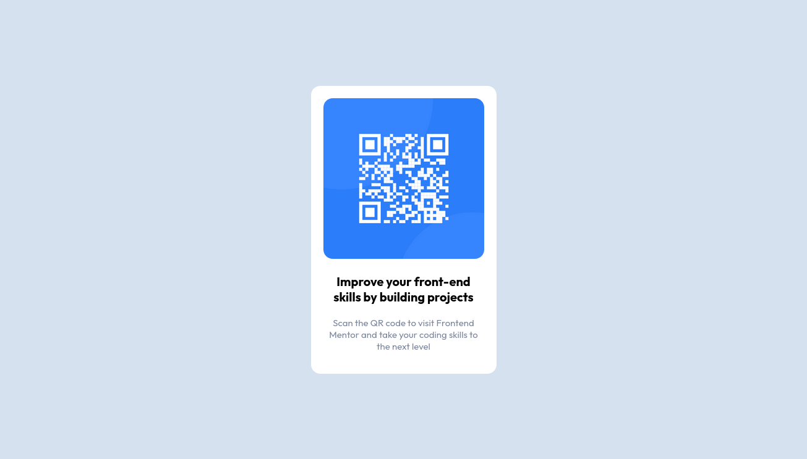

# QR Code Component

> A starting challenge from Frontend Mentor

## Table of contents

- [Overview](#overview)
- [My process](#my-process)
	- [Useful resources](#useful-resources)
- [Author](#author)

## Overview

QR Code Component is a starting challenge from Frontend Mentor, where the purpose is to
create a card with a QR code and text and then center that card on the page, which
automatically adapts to the size of the browser window.

Want to see it live? Check it out on the Environment section, or click [here!](https://rafael-holanda.github.io/qr_code_component/)

Or, do you want to check the challenge page? Click [here!](https://www.frontendmentor.io/challenges/qr-code-component-iux_sIO_H/hub/qr-code-component-PMrv_POh-n)

## My process

This project was made with the [replit.com](https://replit.com) IDE, where I used basic HTML and CSS. 
Also, I used some basic Flexbox properties to properly center the QR card.

Working on this project I was able to better develop my CSS skills, where I learned
key concepts of Flexbox, responsiveness and how to import external fonts into the code.

With this project done, I want to continue developing my front-end skills, learn more
about Flexbox, and do bigger and more complex projects.

### Useful resources

- [CSS Tricks](https://css-tricks.com/snippets/css/a-guide-to-flexbox/) - This helped me
to use Flexbox in my project, to centralize the QR card in a practical and easy way.

## Author

- Frontend Mentor - [@rafael-holanda](https://www.frontendmentor.io/profile/rafael-holanda)
- Twitter - [@rafinholanda](https://twitter.com/rafinholanda)
